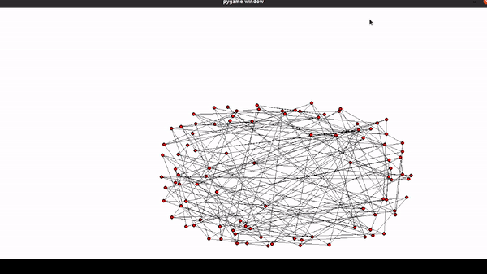

# pygraphforce

pygraphforce is a python library of force directed graphs algorithms using [pygraph](https://github.com/ablarry/pygraph) structure and  rendering with [pygame](https://www.pygame.org/)

### Force directed algorithms 
Force directed algorithms are among the most flexible methods for calculating layouts of simple undirected graphs. Also known as spring embedders, such algorithms calculate the layout of a graph using only information contained within the structure of the graph itself, rather than relying on domain-specific knowledge.

### Fruchterman algorithm (mesh model 100 vertices)



### Quickstart
```
git clone https://github.com/ablarry/pygraphforce.git
```
### Examples:
* Fruchterman algorithm
```
g = models.mesh(10, 10)
fruchterman = Fruchterman(g)
fruchterman.run()
```

  
* Spring algorithm
```
g = models.mesh(10, 10)
spring = Spring(g)
spring.run()
```

### References
* [Graph pyforce video](https://youtu.be/2ZJ1yAMHrUo)
* [Embedders and Force Directed Graph Drawing Algorithms](https://arxiv.org/abs/1201.3011)